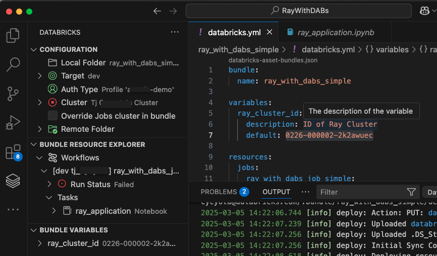
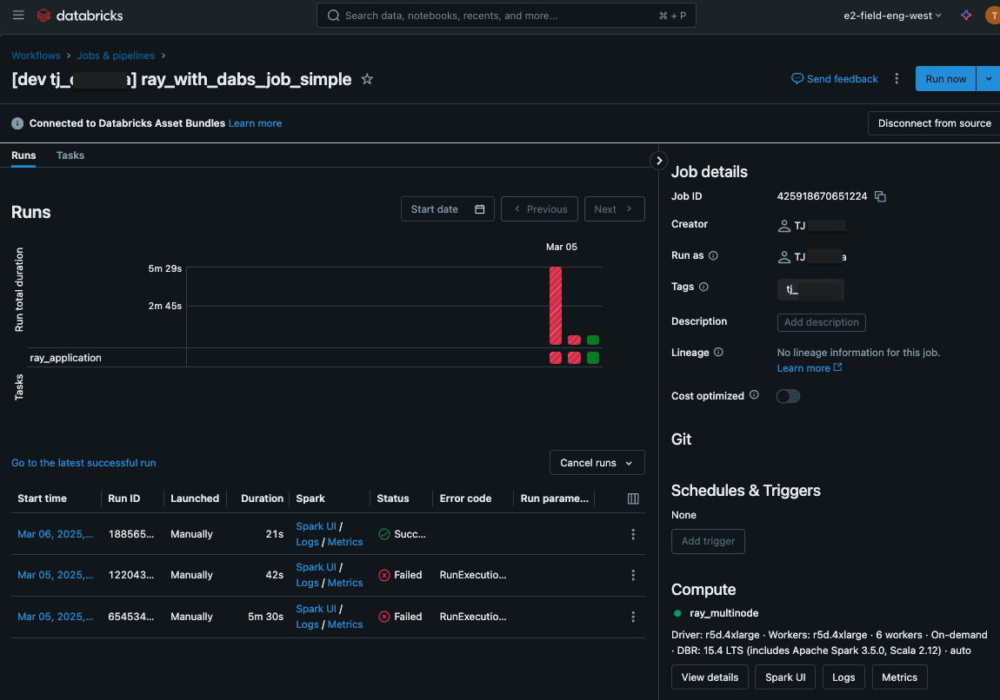
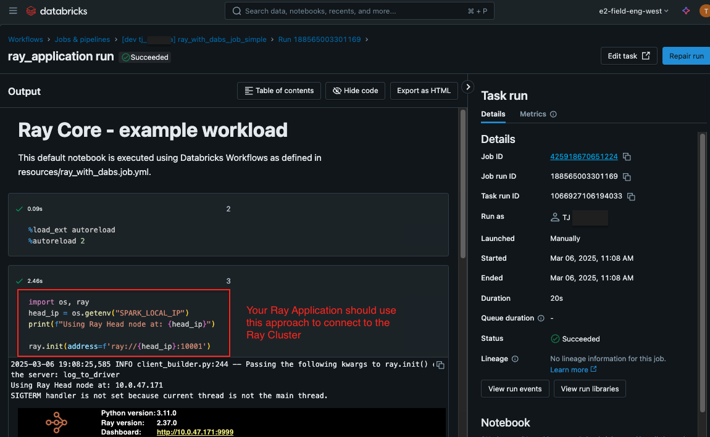

# Runbook: Work locally on an IDE and deploy to remote Ray cluster using DABs

This README file is a companion to the DABs code in this folder, demonstrating how to:
* Work locally from outside the Databricks UI, for example from VS Code, to develop Ray application code
* Deploy that Ray application to an already-running Ray cluster in Databricks as a single-task workflow

## Setup: 

The following is required to run the code in this repo:

1. Setup your IDE.
    * Screenshots in this repo demonstrate the [VS Code Databricks extension](https://docs.databricks.com/aws/en/dev-tools/vscode-ext/install), which provides native integration and workflow extensions for Databricks Asset Bundles.
    * 
1. Clone this repo & open the Bundle definition `databricks.yml`.
    * Alternatively, you can apply the concepts demonstrated here to an [Asset Bundle template](https://learn.microsoft.com/en-us/azure/databricks/dev-tools/bundles/templates) or customize to your CICD processes using DABs.
1. Setup a **Global** Ray cluster:
    * From within the workspace or via a separate DAB, create a [Global Ray Cluster](https://docs.databricks.com/aws/en/machine-learning/ray/ray-create#starting-a-global-mode-ray-cluster). A global Ray Cluster is required, and a user-specific Ray cluster will not work with this DABs approach. 
    * For an effective guide on setting up a Global Ray Cluster with monitoring enabled, see this blog post: [Ray Monitoring Made Easy: Prometheus & Grafana with Ray on Databricks Clusters](https://community.databricks.com/t5/technical-blog/ray-monitoring-made-easy-prometheus-amp-grafana-with-ray-on/ba-p/108641)
1. Note the ID of this Ray cluster. 
    * Databricks cluster IDs are of the form `0123-012345-1a2bcdef`. Every cluster definition you create in Databricks will have a different ID.
    * Similar to how you would use a Ray cluster's head node IP to submit jobs, you will use this cluster ID to identify the cluster on which Ray applications should be run. 
    * See [docs](https://docs.databricks.com/aws/en/workspace/workspace-details#cluster-url-and-id) for more information. 
1. Update the `ray_cluster_id` Bundle variable
    * In the file `databricks.yml`, replace the `default` value with your cluster ID.
    * Note that if you are deploying a DAB to multiple workspaces (e.g. dev/stg/prd), your Ray cluster ID will be different in each. Learn more about [DABs variables](https://docs.databricks.com/aws/en/dev-tools/bundles/variables), and see the default variable override in in the Bundle definition.
1. Use DABs, deploy the Bundle and run the job
    * Using the [Databricks CLI](https://docs.databricks.com/aws/en/dev-tools/cli/bundle-commands#sync-a-bundles-tree-to-a-workspace) `databricks bundle sync...` or VS Code [Bundle UI](https://docs.databricks.com/aws/en/dev-tools/vscode-ext/bundles#deploy-and-run-a-job), run the job.
    * In the Databricks UI, you should see the Workflow created with a corresponding Run. 
    * 
    * 
1. Customize from here!
    * Using this approach, you can deploy any arbitrary Ray code to a Ray on Databricks cluster.
    * Note the proper technique to init your Ray session on a Global Ray cluster:
    ```
    import os, ray
    head_ip = os.getenv("SPARK_LOCAL_IP")
    print(f"Using Ray Head node at: {head_ip}")

    ray.init(address=f'ray://{head_ip}:10001')
    ```


